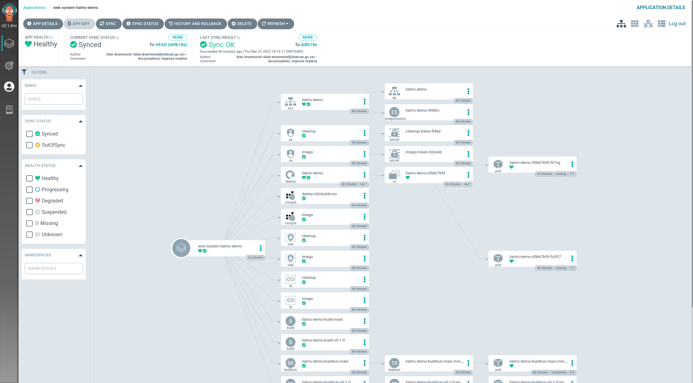

# terragrunt-experiment

## What you'll need

### Secrets & Variables

**tl;dr, you'll need**

- Docker secrets
- Github API token (read/write)
- A digital ocean API token
- `doctl,terraform,terragrunt,task`. See [tools](#tools).

-----------

The module currently requires the following secrets

```sh
export TF_VAR_do_token=$(pass digital-ocean-doctl-token)
export TF_VAR_registry_read_token=$(pass dockerhub-k8s-read)
export TF_VAR_registry_write_token=$(pass dockerhub-k8s-write)
export TF_VAR_github_read_token=$(pass github-api-read)
export TF_VAR_github_deploy_token=$(pass github-deploy-key-gen)
```

Along with the following variables:

```
# terraform.tfvars
cluster_name = "liatrio-demo"
domain_name = "happylittlecloud.xyz"

github_username = "blairdrummond"
github_repo = "terragrunt-experiment-manifests"

registry_server = "https://index.docker.io/v1/"
registry_username = "blairdrummond"
```

If you change the github username and docker username, you will also need to replace them in the [ArgoCD Manifests repository](https://github.com/blairdrummond/terragrunt-experiment-manifests). 

**If you deploy without docker secrets, most things will work. You just won't be building images.**

The git credentials are to read the private repositories, and argo events uses a credential to auto-configure a github webhook. If the repos become public, these would also be unnecessary.

#### DNS

I pointed `happylittlecloud.xyz` to the digitalocean nameservers in advance so that I can use the domain for the purpose of this demo. If you want to do this too, take a look at [digitalocean's docs on dns-registrars](https://docs.digitalocean.com/tutorials/dns-registrars/).

After configuring your DNS registrar, you need to modify the `environments/prod/dns` domain variable, and unfortunately **you also will need to modify the annotation on the ingress controller in the manifests repo** and all Ingress objects there.

[The Ingress Gateway variables](https://github.com/blairdrummond/terragrunt-experiment-manifests/blob/b906b56effc66d140a1859dc11c4463cfe80e51c/applications/platform/nginx/application.yaml#L20-L21)

[Example Ingress object needing edits]( https://github.com/blairdrummond/terragrunt-experiment-manifests/blob/b906b56effc66d140a1859dc11c4463cfe80e51c/applications/web-system/liatrio-demo/deploy/ingress.yaml#L11-L14)

### Tools

- doctl
- terragrunt
- terraform
- [task](https://taskfile.dev/#/installation)

**Optional:**
- k3d (Note, the metallb configuration might be Linux Only?)

## How to run

- Pray to the demo gods
- Configure secrets (either as env vars or with secrets.env)
- `. ./secrets.env` (to source the secrets)
- Run `task prod` (or `task all` if you're on linux and have `k3d`[^1])
- [If you configured a domain](#dns), wait a few minutes[^2] and run `task prod:dns:apply` 

[^1]: It's linux only, I think, because the metallb tool requires a path to a docker socket.
[^2]: This is because ArgoCD deploys the ingress gateway and loadbalancer, and you need to wait for that load balancer to get initialized to get the IP address. It's possible to get this automatically, but it's a pain.

## Log into ArgoCD


**Note, you may first want to run `task login:doctl` to log into digitalocean.**

Once your clusters are up, switch to the context you'd like to see (either the k3d or prod cluster), and run `task login:argo-cd`. You'll see

```sh
➜  terragrunt-experiment-infra git:(main) ✗ task login:argo-cd
=== kube context ========
k3d-liatrio-demo
=== ArgoCD Login ========
username: admin
password: XXXXXXXXXXXXXXXX
=========================
Forwarding from 127.0.0.1:8000 -> 8080
Forwarding from [::1]:8000 -> 8080
```

This will print credentials for you, which you can use at `http://localhost:8000`. You'll be able to see most of the services deployed to the cluster in the UI.




## How to tear down

- Run `task destroy`
